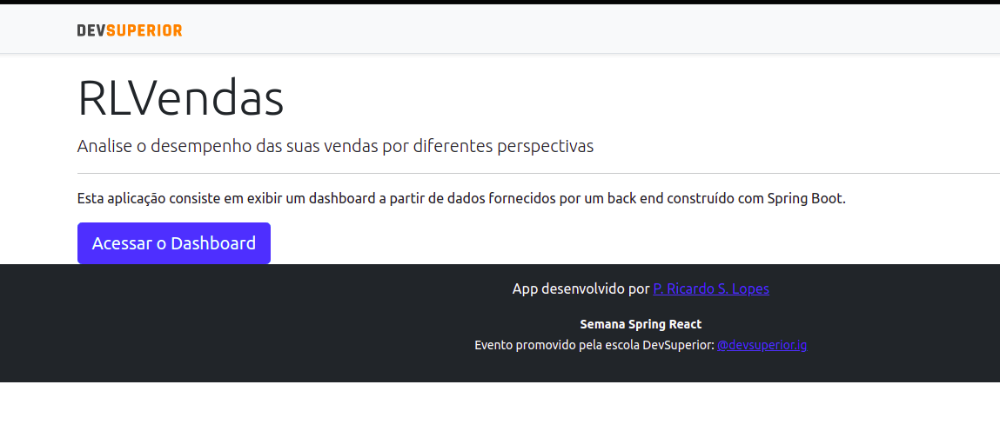
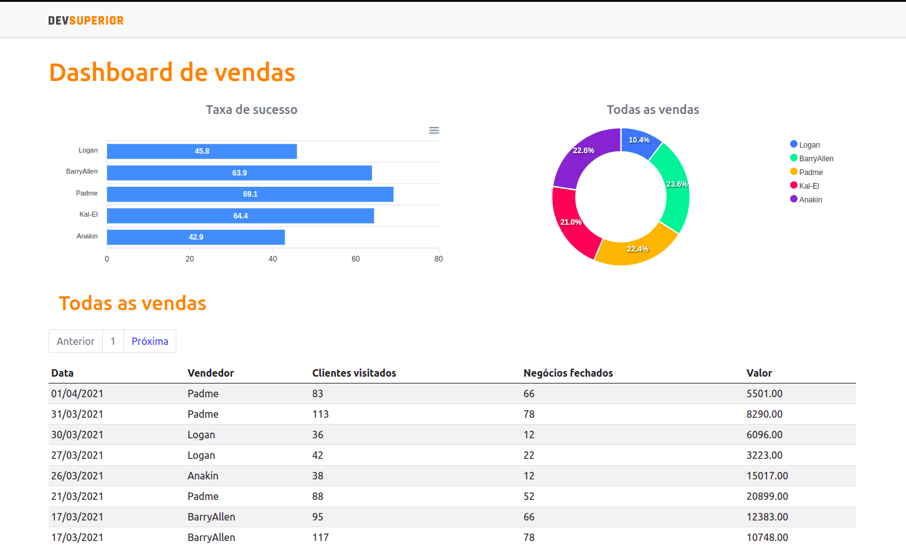

# RLVendas
[](https://github.com/RicardoLopes1/project-sds3/blob/master/LICENSE) 

# Sobre o projeto

https://rlvendas.netlify.app/

RLVendas é uma aplicação *full stack web* construída durante a 3ª edição da **Semana Spring React** (#sds3), evento organizado pela [DevSuperior](https://learn.devsuperior.com "Site da DevSuperior"). 

Esta aplicação consiste em uma tela inicial com as informações da proposta da aplicação e um *dashboard* onde é possível encontrar as vendas dos vendedores listada por data, suas visitas aos clientes e suas vendas bem sucedidas. Também há dois gráficos, onde o de barras mostra  a taxa de sucesso de vendas, e o de rosca mosta a quantidade total de vendas.

## Layout web




# Tecnologias utilizadas
## Back end
<p align="left"> 
<a href="https://www.java.com" target="_blank">  </a>
<a href="https://maven.apache.org" target="_blank">  </a> 
<a href="https://spring.io/" target="_blank">  </a>
<a href="https://pt.wikipedia.org/wiki/Java_Persistence_API" target="_blank">  </a>
</p>

## Front end
<p align="left"> 
<a href="https://apexcharts.com" target="_blank">  </a> 
<a href="https://www.w3.org/html/" target="_blank">  </a> 
<a href="https://www.w3schools.com/css/" target="_blank">  </a> 
<a href="https://www.javascript.com" target="_blank">  </a> 
<a href="https://www.typescriptlang.org/" target="_blank">  </a>
<a href="https://reactjs.org/" target="_blank">  </a>
</p>

## Implantação em produção
### Back end
<a href="https://heroku.com" target="_blank">  </a> 

### Front end 
<a href="https://www.netlify.com" target="_blank">  </a> 

### Banco de dados 
<a href="https://www.postgresql.org" target="_blank">  </a>

# Como executar o projeto

## Back end
Pré-requisitos: Java 11

```bash
# clonar repositório
git clone https://github.com/RicardoLopes1/project-sds3.git

# entrar na pasta do projeto back end
cd backend

# executar o projeto
./mvnw spring-boot:run
```

## Front end
Pré-requisitos: npm / yarn

```bash
# clonar repositório
git clone https://github.com/RicardoLopes1/project-sds3.git

# entrar na pasta do projeto front end
cd frontend

# instalar dependências
yarn

# executar o projeto
yarn start
```

## Autor
Paulo Ricardo da Silva Lopes
<p align="left">
<a href="https://linkedin.com/in/paulo-ricardo-da-silva-lopes-092406197" target="_blank"></a>
<a href="https://fb.com/ricardosilva31" target="_blank"></a>
</p>

## Agradecimentos
[DevSuperior - escola de programação](https://learn.devsuperior.com "Site da DevSuperior").
<p align="left">
<a href="https://instagram.com/devsuperior.ig" target="_blank">  </a> 
<a href="https://youtube.com/devsuperior" target="_blank">  </a>
</p>